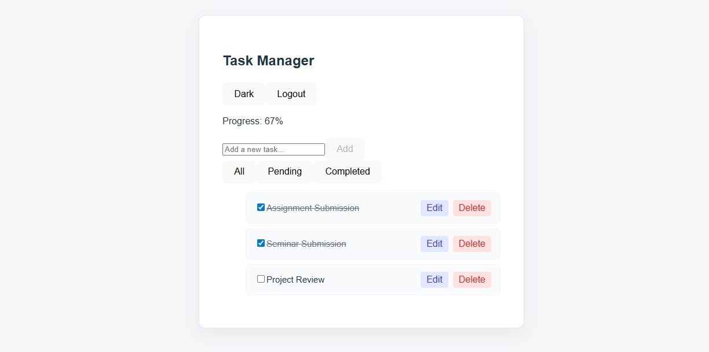

# Task Manager – Full Stack Application

A full-stack Task Manager application built using React and Django REST Framework with JWT authentication. 
Users can securely register, log in, and manage their personal tasks with full CRUD functionality.

## Features
* **JWT-based user authentication** (Login / Register / Logout)
* **Secure task management** (tasks are private per user)
* **Create, edit, delete tasks**
* **Mark tasks as completed or pending**
* **Filter tasks** (All / Completed / Pending)
* **Completion percentage progress indicator**
* **Dark / Light mode toggle**
* **Clean, responsive, and minimal UI**

## Tech Stack
### Frontend
* React
* Axios
* CSS
### Backend
* Django
* Django REST Framework
* SimpleJWT
* SQLite (default database)

## Project Structure
### Backend (`core/`)
- `tasks/`: Task management logic (models, views, serializers)
- `core/`: Project configuration (settings, urls)
- `manage.py`: Django management script

### Frontend (`myapp/`)
- `src/`: React components and logic
- `public/`: Static assets
- `package.json`: Frontend dependencies

## API Endpoints
| Method | Endpoint | Description |
| :--- | :--- | :--- |
| POST | `/api/register/` | Register new user |
| POST | `/api/login/` | Login (JWT) |
| GET | `/api/tasks/` | Get logged-in user tasks |
| POST | `/api/tasks/` | Create task |
| PATCH | `/api/tasks/<id>/` | Update task |
| DELETE | `/api/tasks/<id>/` | Delete task |

## Setup Instructions

### 1. Clone the Repository
```bash
git clone [https://github.com/YOUR_USERNAME/YOUR_REPO_NAME.git](https://github.com/YOUR_USERNAME/YOUR_REPO_NAME.git)
cd Task

cd core
# It is recommended to use a virtual environment
python -m venv venv
..\venv\Scripts\activate
pip install -r requirements.txt
python manage.py migrate
python manage.py runserver

Backend runs at: http://127.0.0.1:8000/

cd myapp
npm install
npm run dev

Frontend runs at: http://localhost:5173/

Usage
Open the frontend URL in a browser.

Register a new account or Login.

Add new tasks using the input form.

Click task title to mark it completed/pending.

Filter tasks using All / Completed / Pending.

Toggle Dark/Light mode using the button at the top-right.


Screenshots
Login - 
Register - 

Dashboard - 

Dashboard - 

Notes
Tasks are private per user.

JWT tokens are stored in localStorage for session persistence.

Password validation and security are enforced by Django.